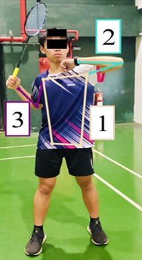
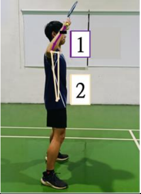
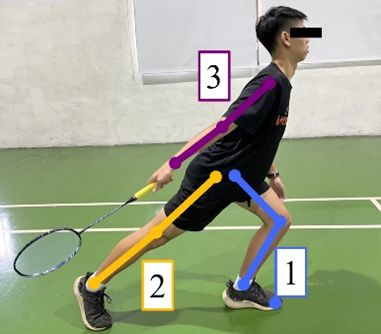
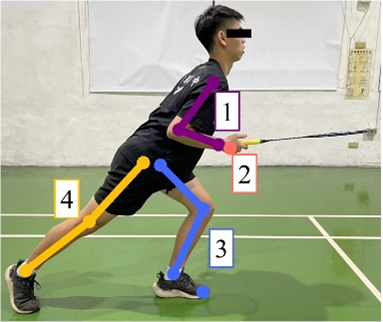
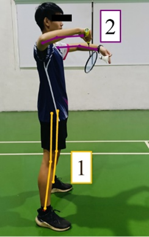

# BadmintonPro
Badminton Pro is a software dedicated to the training and improvements of badminton amateurs. With the increase of people being interested in badminton, we propose a software for amateurs to improve. Badminton Pro is defined to have several features, we would like the user to just film a long video, then Badminton Pro would auto-edit the long videos to small clips, these clips would have to be a swing of the racket. Then Badminton would classify what just happened in this clip alone. Finally, we would use a rule-based model using a HPE(Human Pose Estimation Model) to figure out what pose error was present in the clip. (We would also want this system architecture to be expanded to other sports as well : Tennis, Squatch, and so on…….). In this Repo, we will be teaching you how to make your own badminton assistant.

### ‼️ATTENTION‼️
Note: This is only an idea on how to make an app to “maybe” improve your badminton skills. This hasn’t been entirely proven to improve one’s skills.
This is a medium level project that is a great start for Deep Learning Integration projects, learning AI-related models wouldn't be that hard after this project.

### 📔 Table of Contents
1. Introduction & Demo
2. Common Badminton Poses
3. Data Collection
4. Pose Classifiers
5. YOLO Training
6. Common Metrics
7. Pose Error Detection
8. OpenAI Integration

# 1.Introduction & Demo
Link: 

Abstract: This course provides an introduction to Badminton Pro, covering our current development progress and achievements. We'll explore the project's objectives, examine the repository contents, discuss implementation constraints, and conclude with a live demonstration of the application's functionality.

## 🎯 Learning Goals
1. How to run and choose HPE models.
2. How to write image processing tools with opencv.
3. How to run, train, and evaluate YOLO models.
4. How to make&compare your own pose classifiers.
5. How to make a web html file to import videos and output video results.

## 💾 In this Repo......
In this repo, we will be using YOLO & three different classifiers to accomplish three goals.
1.  Develop a procedure to auto-edit badminton long videos into clips.
2.  Run pose classification on these clips to determine what the clips' pose was.
3.  Determine what pose errors were according to the clips' determined pose.
4.  (Optional) Use LLM API's to integrate pose error and pose to give pose correction advices.

## ⛔ Prerequisites
1. Is an amateur who is interested in playing badminton, but doesn't know where to start.
2. Has purchased a camera stand that is at least 1.5 meters above.
3. Has a phone that can record half a badminton ground range, with the person's full body being recorded. 

## ⏩ QuickStart
First, clone this repo, then install the required packages. These are the commands below.
```bash
git clone https://github.com/Max8262/BadmintonPro.git
cd BadmintonPro
pip install -r requirements.txt
```
You can run the `server.py` for a quick preview of what we've achieved. 


After running this script, you should see this.


You should see this UI when clicking `http://127.0.0.1:5000`.


There would also be a small video for you to download and try it out.
[(Video Link)](https://drive.google.com/file/d/1ebt2fHmnDWuiKouhDj8P2IUKjpiWqz_k/view?usp=sharing)

## 📦 Packages & Environment Introduction
Python Version 3.10.9
1.	flask (v3.1.0): Provides lightweight web framework functionality. 
2.	joblib (v1.4.2): Used for serializing and saving machine learning models. 
3.	matplotlib (v3.10.0): Responsible for plotting experimental result charts. 
4.	mediapipe (v0.10.20): Human pose keypoint tracking library. 
5.	moviepy (v1.0.3): Handles video slow-motion processing. 
6.	numpy (v1.26.4): Mathematical computation library for data centralization and processing. 
7.	opencv-python (v4.11.0.86): Manages video reading, segmentation, and preprocessing. 
8.	openai (v1.61.0): Enables connection to ChatGPT-4 for pose improvement suggestions. 
9.	pandas (v2.2.3): Handles CSV file reading and data manipulation. 
10.	scikit-learn (v1.6.1): Open-source machine learning library for generating model performance reports. 
11.	seaborn (v0.13.2): Responsible for confusion matrix visualization. 
12.	tensorflow (v2.18.0): Open-source deep learning framework for model training. 
13.	tensorrt (v10.8.0.43): Handles YOLO model quantization and optimization. 
14.	ultralytics (v8.3.70): YOLOv11 object detection model library.

## 🛠️ Additional Tools
Also, in order to train a CNN model, we would have to annotate where our object actually is, thus, we need to use an annotation tool to prepare our dataset. 
In this project, we would be using CVAT as our main tool. However other tools are good as well(ImgLabel, LabelStudio, Roboflow). 

# 2. Common Badminton Poses & Expert Poses
Badminton Poses vary a lot, additionally, pro players have their own unique style of play, thus we want amateurs to first learn the orthodox/standard poses. After discussion with several badminton experts, we decided to add these poses for amateurs to learn, clear, drive, lift, backhand serve, and net shot. We didn't add smash because for amateurs, this wasn't considered necessary for them to learn. The list below contains the specific pose with their correspondent pictures and their common errors.

## Pose Name & Pictures
1. Clear - Commonly used to move the opponent or squeeze their space.
   
2. Drive - An attacking technique that typically appears when returning a smash.
   
3. Lift - Commonly occurs when hitting balls below waist level(This is the hardest to master).
   
4. Net Shot - Can move the opponent and also lead them to hit a high ball, facilitating attacks.
   
5. Backhand Serve - Guides the development of the game at the beginning of a match.
   

<table>
  <tr>
    <th>Technique</th>
    <th>Error Items</th>
    <th>Diagram</th>
    <th>Detailed Explanation</th>
  </tr>
  
  <!-- Clear Technique -->
  <tr>
    <td rowspan="3"><strong>Clear</strong></td>
    <td>1. Incomplete lateral body positioning</td>
    <td rowspan="3"></td>
    <td>The body's trunk rotation is insufficient, unable to effectively utilize body power to hit the ball.</td>
  </tr>
  <tr>
    <td>2. Insufficient auxiliary hand extension</td>
    <td>When the arm is not extended and the elbow angle is less than 90 degrees, the arm angle is less than 70 degrees, making it impossible to effectively utilize body rotation to hit the ball.</td>
  </tr>
  <tr>
    <td>3. Attacking hand position too low</td>
    <td>The arm and body center line are too small, unable to hit high attacking balls.</td>
  </tr>
  
  <!-- Drive Technique -->
  <tr>
    <td rowspan="2"><strong>Drive</strong></td>
    <td>1. Ball path not raised</td>
    <td rowspan="2"></td>
    <td>Unable to immediately raise and prepare for the next ball.</td>
  </tr>
  <tr>
    <td>2. Body too upright</td>
    <td>The body lacks forward lean and low center of gravity.</td>
  </tr>
  
  <!-- Lift Technique -->
  <tr>
    <td rowspan="3"><strong>Lift</strong></td>
    <td>1. Knee extension</td>
    <td rowspan="3"></td>
    <td>Knee extends out of the foot, leg angle less than 90 degrees, body center of gravity concentrated on the knee.</td>
  </tr>
  <tr>
    <td>2. No elbow flexion forward</td>
    <td>The attacking hand and front foot are different.</td>
  </tr>
  <tr>
    <td>3. Attacking hand elbow too extended</td>
    <td>The attacking hand elbow extension is too much after the ball.</td>
  </tr>
  
  <!-- Net Drop Technique -->
  <tr>
    <td rowspan="4"><strong>Net Drop</strong></td>
    <td>1. Wrist extension</td>
    <td rowspan="4"></td>
    <td>The ball is too far from the body, no extension, wrist angle less than 120 degrees.</td>
  </tr>
  <tr>
    <td>2. Exit point too low</td>
    <td>The ball's exit trajectory is too low, no high attacking ball.</td>
  </tr>
  <tr>
    <td>3. Knee extension</td>
    <td>Knee extends in a lunging position, leg angle less than 90 degrees.</td>
  </tr>
  <tr>
    <td>4. No elbow flexion forward</td>
    <td>The attacking hand and front foot are different.</td>
  </tr>
  
  <!-- Serve Technique -->
  <tr>
    <td rowspan="2"><strong>Serve</strong></td>
    <td>1. No elbow flexion forward</td>
    <td rowspan="2"></td>
    <td>The serve must use elbow flexion forward, not elbow extension behind.</td>
  </tr>
  <tr>
    <td>2. Incorrect serve position</td>
    <td>The serve position and attacking point should be positioned close to the waist.</td>
  </tr>
</table>


# 3. Data Collection
For every AI model out there, the hardest part is the data collection, without large amounts of data, AI is basically useless. In our project, we self recorded and audited every badminton photo. What we did was we first record our data as a video, then we 

# 4. Pose Classifiers

# 5. YOLO Training

# 6. Common Metrics

# 7. Pose Error Detection

# 8. OpenAI Integration(Optional)


